# 👻 GhostDev - Personalized Code Intelligence

> An AI-powered VS Code extension that provides context-aware code suggestions based on your own GitHub repositories.

## 🌟 Overview

GhostDev is not another "vibe coding" tool. It's a sophisticated code assistant that learns from **your** coding patterns and repositories to provide personalized suggestions and refinements. By analyzing your selected GitHub repositories, GhostDev understands your coding style and project architecture to deliver contextually relevant improvements.

---

## 🎯 Key Features

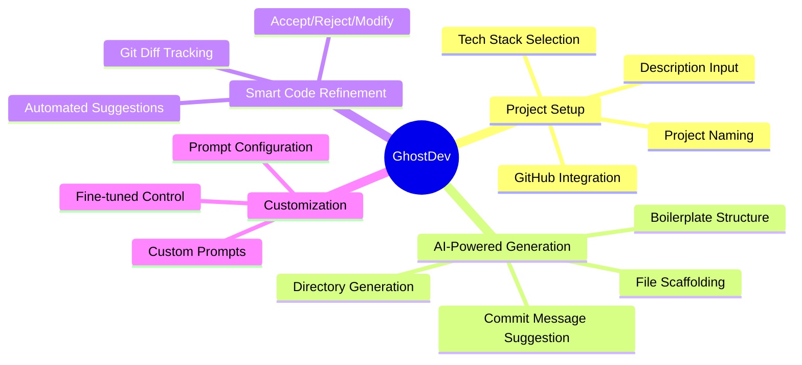

---

## 🏗️ System Architecture

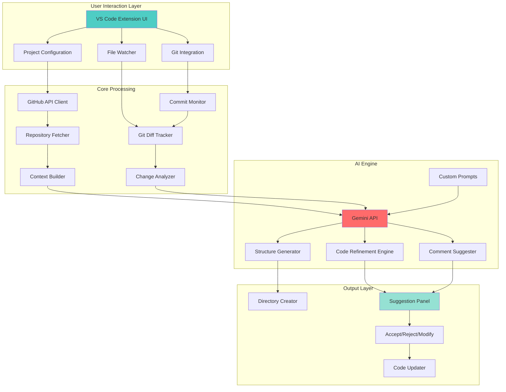

---

## 📊 Workflow Diagram

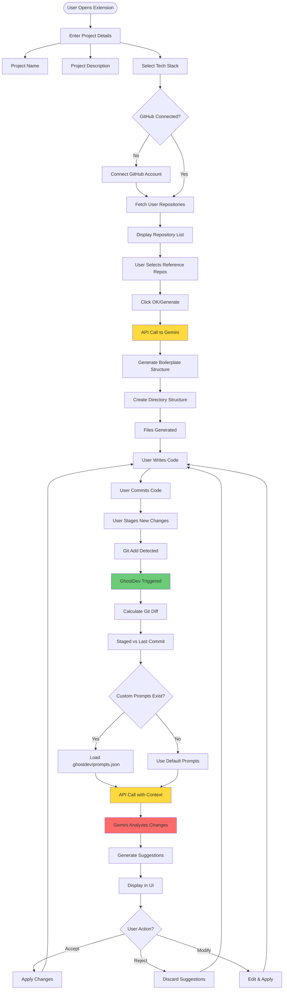

---

## 🔄 Extension Lifecycle

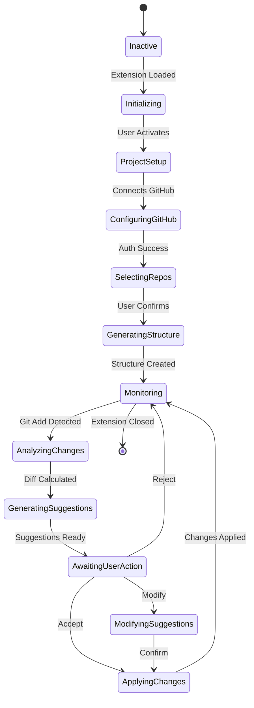

---

## 🎨 Feature Breakdown

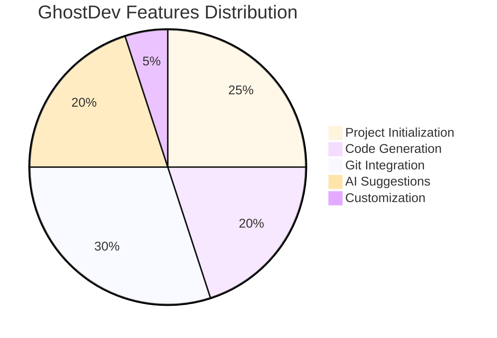

---

## 📋 Data Flow Architecture

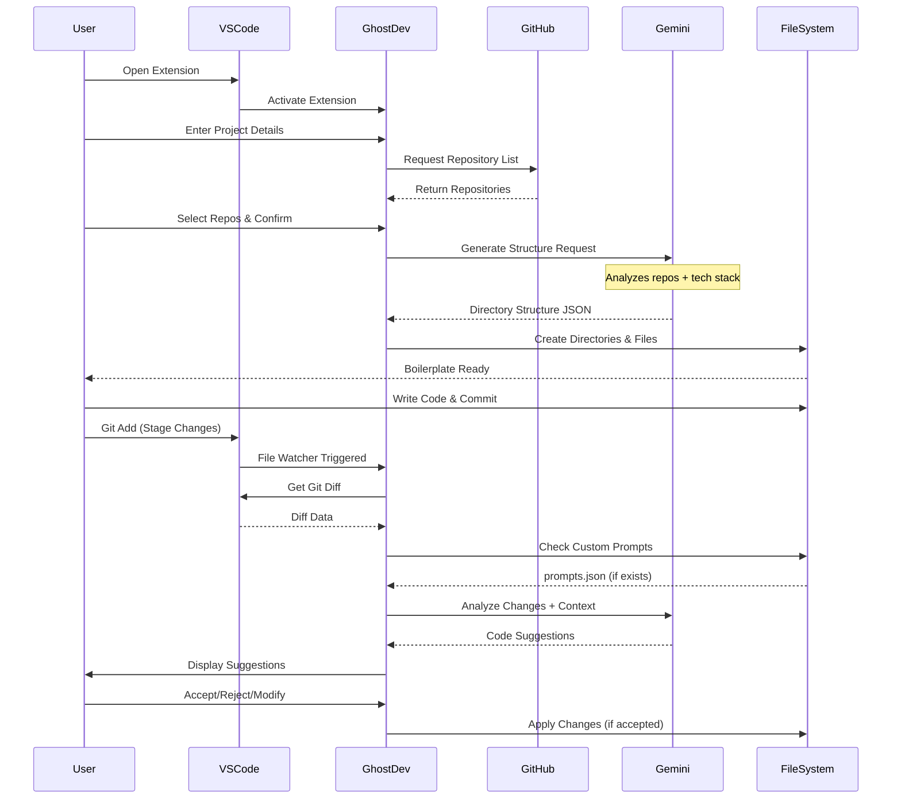

---

## 🛠️ Component Architecture

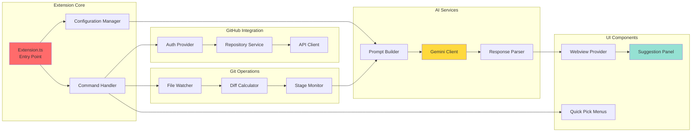

---

## ⚙️ Setup Instructions

### Prerequisites
- Node.js (v14 or higher)
- VS Code (latest version)
- GitHub account
- Gemini API key

### Step-by-Step Setup

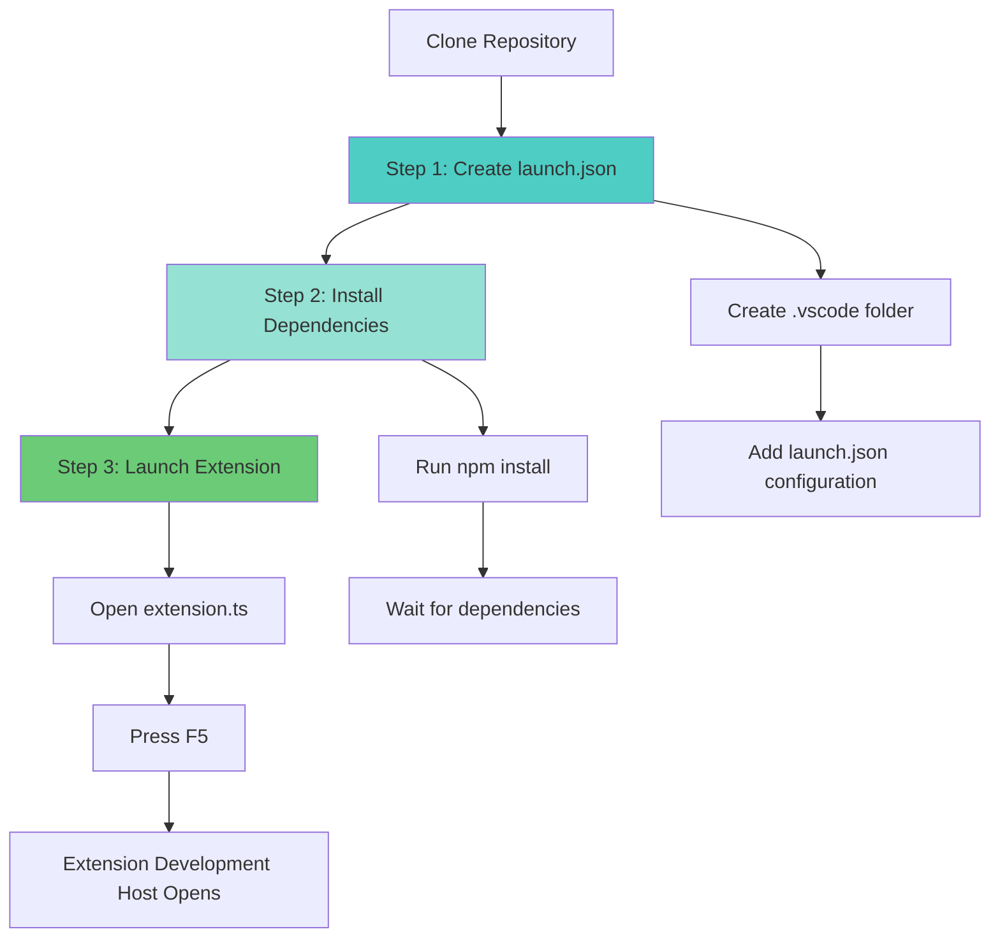

#### **Step 1: Create Launch Configuration**

Create `.vscode/launch.json` in your project root:

```json
{
  "version": "0.2.0",
  "configurations": [
    {
      "name": "Run Extension",
      "type": "extensionHost",
      "request": "launch",
      "args": [
        "--extensionDevelopmentPath=${workspaceFolder}"
      ],
      "outFiles": [
        "${workspaceFolder}/out/**/*.js"
      ],
      "preLaunchTask": "npm: compile"
    },
    {
      "name": "Extension Tests",
      "type": "extensionHost",
      "request": "launch",
      "args": [
        "--extensionDevelopmentPath=${workspaceFolder}",
        "--extensionTestsPath=${workspaceFolder}/out/test/suite/index"
      ],
      "outFiles": [
        "${workspaceFolder}/out/test/**/*.js"
      ],
      "preLaunchTask": "npm: compile"
    }
  ]
}
```

#### **Step 2: Install Dependencies**

```bash
npm install
```

#### **Step 3: Launch Extension**

1. Open `extension.ts`
2. Press `F5` to start debugging
3. A new VS Code window will open with your extension loaded

---

## 🎯 Custom Prompts Configuration

GhostDev supports custom prompts through a configuration file located at `.ghostdev/prompts.json` in your project root.

### Configuration Structure

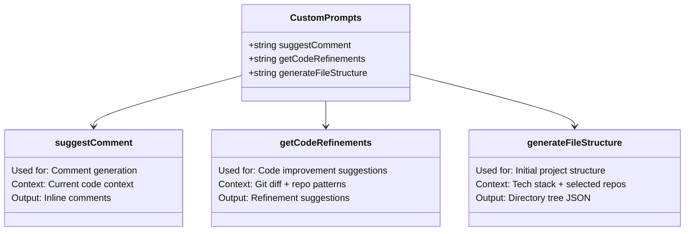

### Example Configuration

Create `.ghostdev/prompts.json`:

```typescript
{
  "suggestComment": "Analyze the code and suggest meaningful comments that explain complex logic, following JSDoc style for functions.",
  
  "getCodeRefinements": "Review the staged changes and suggest improvements focusing on: performance optimization, code readability, error handling, and adherence to best practices from the reference repositories.",
  
  "generateFileStructure": "Generate a project structure that follows industry standards for the selected tech stack, incorporating patterns observed in the reference repositories."
}
```

---

## 📊 Prompt Usage Flow

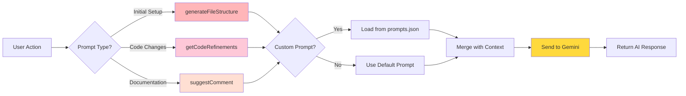

---

## 🔍 Git Integration Details

```mermaid
gantt
    title Git Operations Timeline
    dateFormat X
    axisFormat %s
    
    section File Changes
    User writes code        :0, 10
    User stages changes     :10, 12
    
    section GhostDev Detection
    File watcher triggered  :12, 13
    Calculate diff          :13, 15
    
    section AI Processing
    Build context           :15, 16
    API call to Gemini      :16, 20
    Parse response          :20, 21
    
    section User Interaction
    Display suggestions     :21, 25
    User reviews            :25, 30
    Apply changes           :30, 32
    Suggest commit on terminal :32, 34
```


## 🎭 User Interaction States

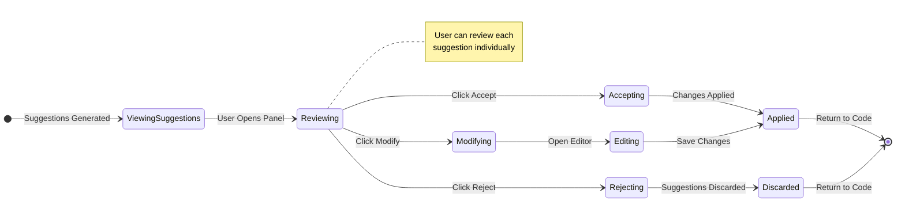

## 📦 Extension Structure

```
ghostdev/
├── 📁 src/
│   ├── 📄 extension.ts          # Entry point
│   ├── 📄 git.d.ts    
│   ├── 📁 assets/
│   │   ├── techStackData.ts
│   ├── 📁 utils/
│   │   ├── githubUtils.ts
│   │   ├── geminiUtils.ts
│   │   ├── promptUtils.ts
│   │   ├── terminalUtils.ts
│   │   └── gitUtils.ts
├── 📁 .vscode/
│   └── 📄 launch.json
├── 📄 package.json
├── 📄 .env
├── 📄 tsconfig.json
└── 📄 README.md
```

---

## 🚀 Quick Start Guide

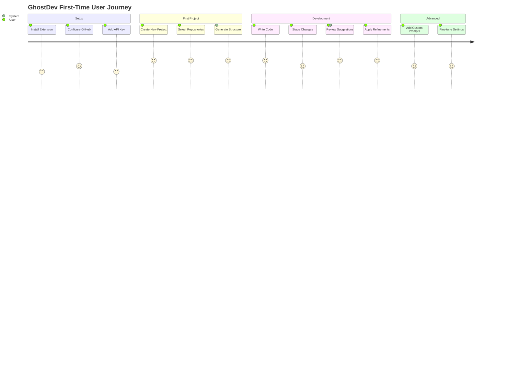

---

## 💡 Best Practices

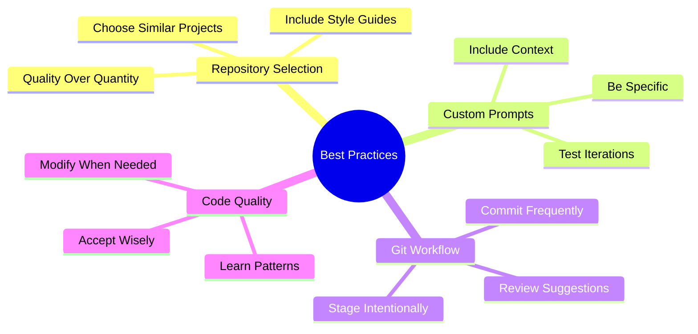

---

## 🤝 Contributing

We welcome contributions! Please follow this workflow:

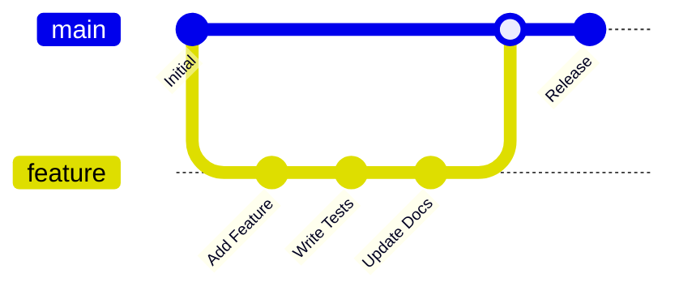

---

## 📝 License

MIT License - see LICENSE file for details


## 🎉 Acknowledgments

Built with:
- 🤖 Google Gemini AI
- 🐙 GitHub API
- 💻 VS Code Extension API
- ⚡ TypeScript

---

<div align="center">

**Made with love by MDGSpace**

[⭐ Star us on GitHub](#) | [🚀 Get Started](#setup-instructions) | [📖 Documentation](#)

</div>