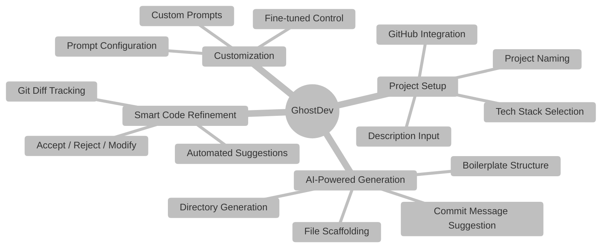
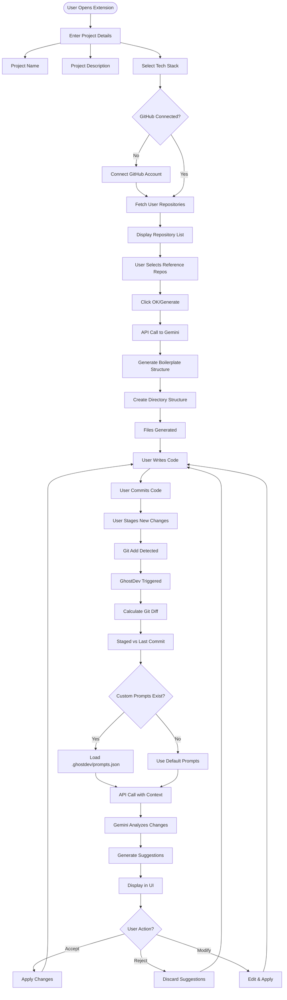
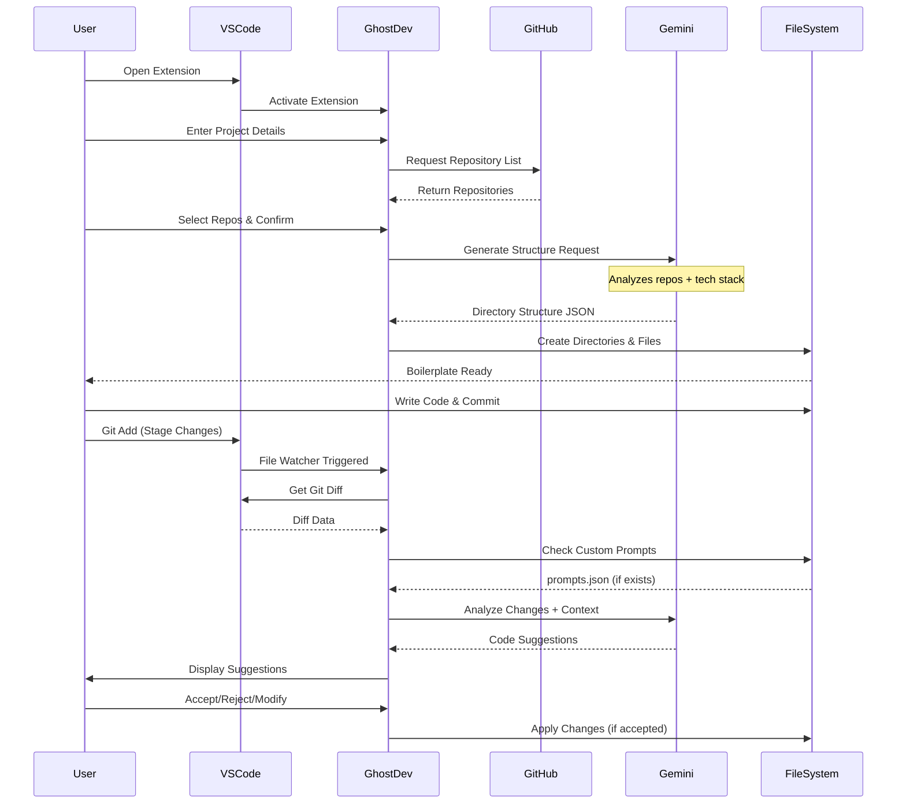
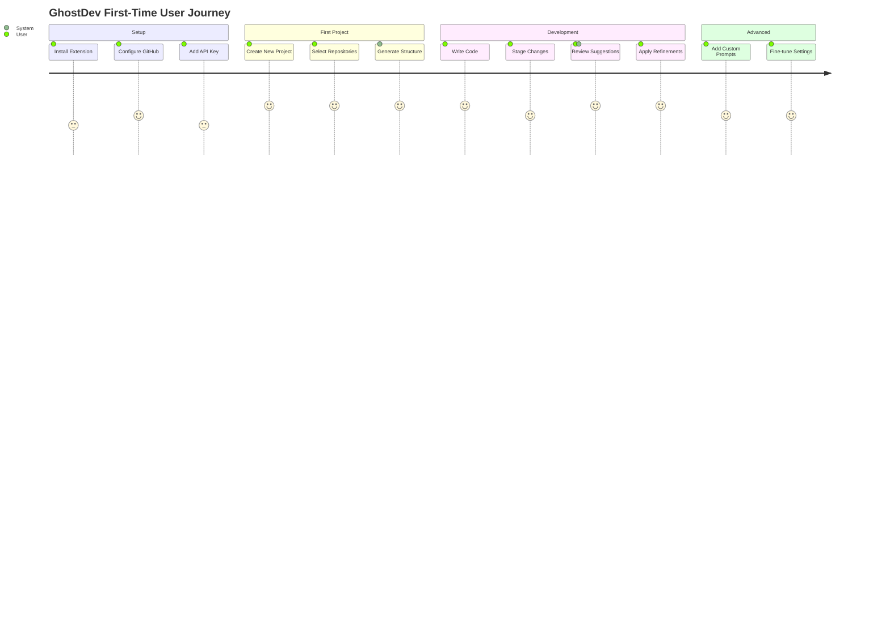

# 👻 GhostDev - Personalized Code Intelligence

> An AI-powered VS Code extension that provides context-aware code suggestions based on your own GitHub repositories.

## 🌟 Overview

GhostDev is not another "vibe coding" tool. It's a sophisticated code assistant that learns from **your** coding patterns and repositories to provide personalized suggestions and refinements. By analyzing your selected GitHub repositories, GhostDev understands your coding style and project architecture to deliver contextually relevant improvements.

---

## 🎯 Key Features



---

## 📊 Workflow Diagram



---

## 📋 Data Flow Architecture



---

## ⚙️ Setup Instructions

### Prerequisites
- Node.js (v14 or higher)
- VS Code (latest version)
- GitHub account
- Gemini API key

### Step-by-Step Setup

#### **Step 1: Create Launch Configuration**

Create `.vscode/launch.json` in your project root:

```json
{
  "version": "0.2.0",
  "configurations": [
    {
      "name": "Run Extension",
      "type": "extensionHost",
      "request": "launch",
      "args": [
        "--extensionDevelopmentPath=${workspaceFolder}"
      ],
      "outFiles": [
        "${workspaceFolder}/out/**/*.js"
      ],
      "preLaunchTask": "npm: compile"
    },
    {
      "name": "Extension Tests",
      "type": "extensionHost",
      "request": "launch",
      "args": [
        "--extensionDevelopmentPath=${workspaceFolder}",
        "--extensionTestsPath=${workspaceFolder}/out/test/suite/index"
      ],
      "outFiles": [
        "${workspaceFolder}/out/test/**/*.js"
      ],
      "preLaunchTask": "npm: compile"
    }
  ]
}
```

#### **Step 2: Install Dependencies**

```bash
npm install
```

#### **Step 3: Launch Extension**

1. Open `extension.ts`
2. Press `F5` to start debugging
3. A new VS Code window will open with your extension loaded

---

## 🎯 Custom Prompts Configuration

You can override **GhostDev's default behavior** by creating a custom prompts file at  
`.ghostdev/prompts.json` in your project's root directory.

The extension will look for specific keys in this file.  
If a key is not found, a built-in default prompt will be used.

---

### 🧩 Available Prompts and Placeholders

Here are the prompts you can customize and the placeholders that will be replaced with dynamic data.

#### **1. suggestComment**
Used to generate a **conventional commit message** for your staged changes.

**Placeholders:**
- `{{diffDataAsJson}}`: Will be replaced with a JSON string representing the staged files, each with a name and diff.

---

#### **2. codeRefinement**
Used to **refactor the code** in your staged files.

**Placeholders:**
- `{{persona}}`: A JSON string describing the project's coding style and conventions.  
- `{{diffDataAsJson}}`: The same JSON string of staged file diffs as above.

---

#### **3. generateFileStructure**
Used to **generate the initial project structure** when initializing a new project.

**Placeholders:**
- `{{projectName}}`: The name of the project.  
- `{{projectDescription}}`: The description of the project.  
- `{{techStack}}`: A comma-separated string of the selected technologies (e.g., `"React, Node.js, Tailwind CSS"`).  
- `{{persona}}`: The same coding style persona as above.

---

### 🧠 Example: `prompts.json`

```json
{
  "suggestComment": "You are a git expert. Write a concise, imperative commit message for the following changes. Your response must be only the message string.\n\nChanges:\n```json\n{{diffDataAsJson}}\n```",

  "codeRefinement": "As a principal engineer, refactor the code described in the diff below. Adhere to the user's coding style. Only return a JSON array of the refined files.\n\nUser Persona:\n{{persona}}\n\nStaged Files:\n```json\n{{diffDataAsJson}}\n```",
  
  "generateFileStructure": "Create a complete file and directory structure as a single JSON object for a new project.\n\nProject: {{projectName}}\nDescription: {{projectDescription}}\nTech: {{techStack}}\n\nFollow this coding style:\n{{persona}}"
}
```

---


## 📦 Extension Structure

```
ghostdev/
├── 📁 src/
│   ├── 📄 extension.ts          # Entry point
│   ├── 📄 git.d.ts    
│   ├── 📁 assets/
│   │   ├── techStackData.ts
│   ├── 📁 utils/
│   │   ├── githubUtils.ts
│   │   ├── geminiUtils.ts
│   │   ├── promptUtils.ts
│   │   ├── terminalUtils.ts
│   │   └── gitUtils.ts
├── 📁 .vscode/
│   └── 📄 launch.json
├── 📄 package.json
├── 📄 .env
├── 📄 tsconfig.json
└── 📄 README.md
```

---

## 🚀 Quick Start Guide


---

## 📝 License

MIT License - see LICENSE file for details


## 🎉 Acknowledgments

Built with:
- 🤖 Google Gemini AI
- 🐙 GitHub API
- 💻 VS Code Extension API
- ⚡ TypeScript

---

<div align="center">

**Made with love by MDGSpace**

[⭐ Star us on GitHub](#) | [🚀 Get Started](#setup-instructions) | [📖 Documentation](#)

</div>